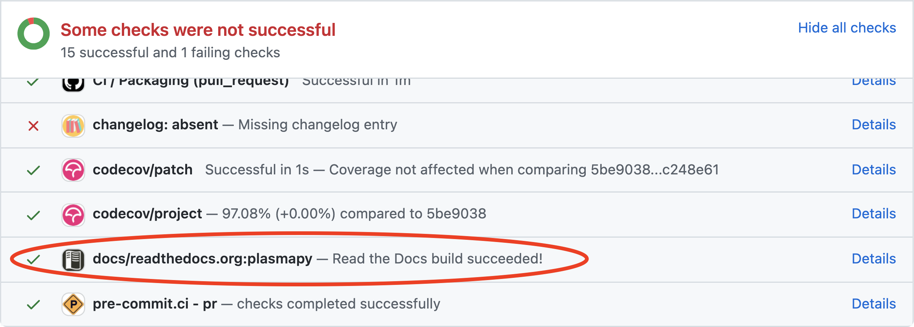

.. _documentation guide:

*******************
Documentation Guide
*******************

Documentation that is up-to-date and understandable is vital to the
health of a software project. This page describes the documentation
requirements and guidelines to be followed during the development of
PlasmaPy and affiliated packages.

.. tip::

   Updating documentation is one of the best ways to make a first
   contribution to an open source software project.

.. note::

   If you discover areas within `PlasmaPy's documentation`_ that are
   confusing or incomplete, please `raise an issue`_! This really helps
   PlasmaPy not only by helping us improve the documentation for all,
   but also by creating opportunities for new contributors to make their
   first contribution to the project.

`PlasmaPy's documentation`_ is hosted by `Read the Docs`_ and is
available at these locations:

* The documentation corresponding to the most recent release to PyPI_ is
  labeled ``stable`` and is found at https://docs.plasmapy.org or
  https://docs.plasmapy.org/en/stable.

* The documentation corresponding to the ongoing development on the
  ``main`` branch in `PlasmaPy's GitHub repository`_, which is often ahead
  of the most recent release, is labeled ``latest`` and can be found at
  https://docs.plasmapy.org/en/latest.

.. tip::

  A preview of the documentation is generated every time a pull request
  is created or updated. You can access this preview by scrolling down
  to the checks at the bottom of a pull request, and clicking on
  :guilabel:`Details` next to :guilabel:`docs/readthedocs.org:plasmapy`.



Building documentation
======================

There are two methods for building the documentation: make_ and tox_.

* Using make_ will build the documentation based off of what is in the
  current directory structure. make_ is quicker for local builds than
  tox_ but requires you to install and set up all dependencies.
* Using tox_ does not require setting up all dependencies ahead of time,
  but is more computationally intensive since it creates a virtual
  environment and builds the package before building the documentation.
  Consequently, PlasmaPy uses tox_ for building the documentation on
  continuous integration testing platforms.

Prerequisites
-------------

To install all Python dependencies required to develop PlasmaPy on your
local computer, enter the top-level directory of the cloned repository
and run:

.. code-block:: bash

   pip install -r requirements.txt

It may also be necessary to install the following software:

* `graphviz <https://graphviz.org/download>`__
* make_ (not necessary for building the documentation with tox_)
* `pandoc <https://pandoc.org/installing.html>`__

Building documentation with make
--------------------------------

If you have make_ installed, then you can build the documentation by
entering the :file:`docs/` directory and running:

.. code-block:: bash

   make html

Including the :samp:`-j {n}` flag in the ``make`` command will enable a
parallel build, where :samp:`{n}` is replaced with the number of
processes or ``auto``. To skip building example notebooks, use
``make html-nonb`` instead.

You can access the documentation landing page by opening
:file:`docs/_build/html/index.html` with your browser of choice.

To remove all files previously generated by ``make``, run:

.. code-block:: bash

   make clean

This command is needed when you make a change to a file that does not
trigger Sphinx_ to rebuild the file that you altered, for example
modifying a CSS_ file. Using ``make clean-api`` instead will only remove
the API portion of the documentation build.

To check that hyperlinks are correct, run:

.. code-block:: bash

   make linkcheck

Building documentation with tox
-------------------------------

You can use tox_ to locally build the documentation by running:

.. code-block:: bash

   tox -e build_docs

You can access the documentation landing page by opening
:file:`docs/_build/html/index.html` with your browser of choice.

To pass any `options to sphinx-build`_, put them after ``--``, as in the
following example:

.. code-block:: bash

   tox -e build_docs -- -j=auto -q

The ``-j=auto`` option tells `sphinx-build`_ to build the documentation
in parallel, with the number of processes being automatically
determined. The ``-q`` flag makes `sphinx-build`_ print out only
warnings and errors, which makes them easier to find and debug.

You can alternatively shorten the documentation build by running:

.. code-block:: bash

   tox -e build_docs_no_examples

This command will build the documentation without executing the
:ref:`example notebooks <example_notebooks>`.

.. tip::

   When writing documentation, please make sure to fix any warnings that
   arise. To enforce this, the ``build_docs`` tox_ environment will fail
   after completing the documentation build if there are any warnings.

Documentation tools
===================

ReStructuredText
----------------

PlasmaPy's documentation is written using the `reStructuredText (reST)`_
markup language. reST_ is human readable when viewed within a source
code file or when printed out using `help`. reST_ also contains markup
that allows the text to be transformed into `PlasmaPy's documentation`_.
reST_ files use the file extension :file:`.rst`. Documentation contained
within :file:`.py` files are in the form of
:wikipedia:`docstrings <docstring>`, which are written in reST_.

ReStructuredText Examples
~~~~~~~~~~~~~~~~~~~~~~~~~

Here we show some examples of commonly used reST_ syntax in
PlasmaPy. Please refer to the documentation for Sphinx_ and reST_ for a
list of available |roles| and |directives|.

This is an example of including headings for the document title,
sections, subsections, and so on. The lines surrounding each heading are
the same length as that heading.

.. code-block:: rst

   ==============
   Document title
   ==============

   Heading 1
   =========

   Heading 2
   ---------

   Heading 3
   ~~~~~~~~~

We can link to code objects by enclosing them in single back ticks.
This linking will work for Python_ commands as well as certain packages
like NumPy_, SciPy_, Astropy_, and pandas_. This linking is described in
the section on :ref:`external-references`. In-line code examples are
enclosed in double back ticks.

.. code-block:: rst

   Here `plasmapy.particles` provides a linked reference to the
   module's documentation.

   Adding a tilde at the beginning `~plasmapy.particles` still
   provides a linked reference to the associated documentation
   but shortens the display so only "particles" is displayed.

   Double backticks are used to show inline code that is not
   cross-referenced: ``import astropy.units as u``.

This reST_ block renders as:

   Here `plasmapy.particles` provides a linked reference to the
   module's documentation.

   Adding a tilde at the beginning `~plasmapy.particles` still
   provides a linked reference to the associated documentation
   but shortens the display so only "particles" is displayed.

   Double backticks are used to show inline code that is not
   cross-referenced: ``import astropy.units as u``.

Sphinx_ can format code blocks for Python_ and the Python_ console
using the :rst:dir:`code-block` :term:`directive`.

   .. code-block:: rst

      .. code-block:: python

         def sample_function():
             return 42

      .. code-block:: pycon

         >>> print(6 * 9)
         54

This reST_ block renders as:

   .. code-block:: python

      def sample_function():
          return 42

   .. code-block:: pycon

      >>> print(6 * 9)
      54

Here are some examples for linking to websites.

.. code-block:: rst

   `PlasmaPy Enhancement Proposals <https://github.com/PlasmaPy/PlasmaPy-PLEPs>`_
   are used to propose major changes to PlasmaPy.

   `Write the Docs`_ has a guide_ on writing software documentation.

   .. _`Write the Docs`: https://www.writethedocs.org
   .. _guide: https://www.writethedocs.org/

This reST_ block renders as:

   `PlasmaPy Enhancement Proposals <https://github.com/PlasmaPy/PlasmaPy-PLEPs>`_
   are used to propose major changes to PlasmaPy.

   `Write the Docs`_ has a guide_ on writing software documentation.

   .. _`Write the Docs`: https://www.writethedocs.org/
   .. _guide: https://www.writethedocs.org/

Displayed math may be created using the :rst:dir:`math`
:term:`directive` using LaTeX_ syntax.

.. code-block:: rst

   .. math::

      \alpha = \beta + \gamma

This reST_ block renders as:

   .. math::

      \alpha = \beta + \gamma

Math can be in-line using the :rst:role:`math` |role|.

.. code-block:: rst

   An example of in-line math is :math:`x`. Using Unicode characters
   like :math:`α + β + γ` makes math easier to read in the source code.

This reST_ block renders as:

   An example of in-line math is :math:`x`. Using Unicode characters
   like :math:`α + β + γ` makes math easier to read in the source code.

Markdown
--------

A few of PlasmaPy's files are written using Markdown_, such as README
files and licenses from other packages. Markdown_ is simpler but more
limited than reST_. Markdown_ files use the file extension :file:`.md`.
Posts on GitHub are written in `GitHub Flavored Markdown`_. The
following code block contains a few common examples of Markdown_
formatting.

.. code-block:: markdown

   # Header 1

   ## Header 2

   Here is a link to [PlasmaPy's documentation](https://docs.plasmapy.org).

   We can make text **bold** or *italic*.

   We can write in-line code like `x = 1` or create a Python code block:

   ```Python
   y = 2
   z = 3
   ```

Sphinx
------

Sphinx_ is the software used to generate `PlasmaPy's documentation`_
from reST_ files and Python_ docstrings. It was originally created to
write Python's documentation and has become the de facto software for
documenting Python_ packages. Almost all Python_ open-source packages
utilize Sphinx_ to generate their documentation.

Configuration
~~~~~~~~~~~~~

The |docs/conf.py|_ file contains the configuration information needed
to customize Sphinx_ behavior. The documentation for Sphinx_ lists the
`configuration options`_ that can be set.

The |docs/_static/css|_ directory contains CSS_ files with `style
overrides`_ for the `Read the Docs Sphinx Theme`_ to customize the look
and feel of the online documentation.

Sphinx extensions
~~~~~~~~~~~~~~~~~

`PlasmaPy's documentation`_ is built with the following Sphinx_
extensions:

* `sphinx.ext.autodoc` for including documentation from docstrings.
* `sphinx.ext.extlinks` for shortening links to external sites (e.g.,
  ``:orcid:`` and ``:wikipedia:``).
* `sphinx.ext.graphviz` to allow Graphviz_ graphs to be included.
* `sphinx.ext.intersphinx` for linking to other projects' documentation.
* `sphinx.ext.mathjax` for math rendering with MathJax_.
* `sphinx.ext.napoleon` for allowing NumPy style docstrings.
* `sphinx.ext.todo` to support ``todo`` |directives|.
* |nbsphinx|_ for including Jupyter_ notebooks.
* |sphinxcontrib-bibtex|_ to enable usage of a BibTeX_ file to create
  the :doc:`../bibliography`.
* |sphinx_copybutton|_ to add a "copy" button for code blocks.
* |sphinx_gallery.load_style|_ for using sphinx-gallery styles.
* |IPython.sphinxext.ipython_console_highlighting|_.
* |sphinx_changelog|_ for rendering towncrier_ changelogs.
* |sphinx-hoverxref|_ for showing floating windows on cross references
  of the documentation.
* |sphinx-notfound-page|_ to add a :wikipedia:`404 <HTTP_404>` page
  for the documentation.
* |sphinx-issues|_ to add roles for linking to GitHub (``:commit:``,
  ``:issue:``, ``:pr:``, and ``:user:``).
* |sphinx-reredirects|_ to enable hyperlink redirects
* `plasmapy_sphinx` for customizations created for use in PlasmaPy and
  affiliated packages. Note that `plasmapy_sphinx` is expected to be
  broken out into its own package in the future.

These extensions are specified in :confval:`extensions` configuration
value in |docs/conf.py|_.

When an extension contains new |roles| or |directives|, it may be
necessary to add them to ``rst-roles`` and ``rst-directives`` in the
``[flake8]`` section of |setup.cfg|_ to avoid linter errors during
continuous integration tests in pull requests.

.. _external-references:

Cross-referencing external packages
~~~~~~~~~~~~~~~~~~~~~~~~~~~~~~~~~~~

Intersphinx_ allows the automatic generation of links to the
documentation of objects in other projects. This cross-package linking
is made possible with the `sphinx.ext.intersphinx` extension and proper
package indexing by the external package using `sphinx.ext.autodoc`.

When we include ```astropy.units.Quantity``` in the documentation, it
will show up as `astropy.units.Quantity` with a link to the appropriate
page in Astropy documentation. Similarly, ```~astropy.units.Quantity```
will show up as `~astropy.units.Quantity`.

To make cross-referencing to an external package available its
mappings have to be defined in the :confval:`intersphinx_mapping`
configuration dictionary contained in |docs/conf.py|_. PlasmaPy
has already include several packages like Python_, NumPy_, SciPy_,
Astropy_, Sphinx_, etc.

New source packages may be added, but please verify that references to a
function or class in that package show up correctly in `PlasmaPy's
documentation`_. The name of the package does not always link as
expected.

.. hint::

   If a cross-link is not working as expected this is usually due to one
   of the following reasons:

   * A typo;
   * The package not being defined in :confval:`intersphinx_mapping`, or
   * The referenced source package not properly or fully indexing their
     own code, which is common in Python_ packages.

Substitutions
~~~~~~~~~~~~~

Some functions and classes are referred to repeatedly throughout the
documentation. reST_ allows us to `define substitutions`_

.. code-block:: rst

   .. |Particle| replace:: `~plasmapy.particles.particle_class.Particle`

Here whenever ``|Particle|`` is used Sphinx_ will replace it with
```~plasmapy.particles.particle_class.Particle``` during build time.

PlasmaPy has certain common substitutions pre-defined so that they can
be used elsewhere in the documentation. For example, we can write
``|Quantity|`` instead of ```~astropy.units.Quantity```, and
``|Particle|`` instead of
```~plasmapy.particles.particle_class.Particle```. For an up-to-date
list of substitutions, please refer to the |docs/common_links.rst|_
file.

Since substitutions are performed by Sphinx_ when the documentation is
built, any substitution used in docstrings will not show up when using
Python's `help` function (or the like). For example, when ``|Particle|``
is used in a docstring, `help` will show it as ``|Particle|`` rather
than ```~plasmapy.particles.particle_class.Particle```. Consequently,
substitutions should not be used in docstrings when it is important that
users have quick access to the full path of the `object` (such as in the
``See Also`` section).

.. _citation-instructions:

Bibliography
~~~~~~~~~~~~

PlasmaPy uses |sphinxcontrib-bibtex|_ to manage references for its
documentation. This Sphinx_ extension allows us to store references
in a BibTeX_ file which is then used to generate the
:doc:`../bibliography`. References in the :doc:`../bibliography` are then
citeable from anywhere in the documentation.

To add a new reference to the :doc:`../bibliography`, open
|docs/bibliography.bib|_ and add the reference in `BibTeX format`_. The
citekey should generally be the surname of the first author (all lower
case) followed by a colon and the year. A letter should be added after
the year when needed to disambiguate multiple references. Include the
DOI_ if the reference has one. If the reference does not have a DOI_,
then include the URL. The ISBN or ISSN number should be included for
books. The ``misc`` field type should be used when citing data sets and
software. Please follow the existing style in |docs/bibliography.bib|_
and alphabetize references by the surname of the first author. To
preserve capitalization, enclose words or phrases within curly brackets
(e.g., ``{NumPy}``).

Use ``:cite:p:`citekey``` to create a parenthetical citation and
``:cite:t:`citekey``` to create a textual citation, where ``citekey``
is replaced with the BibTeX_ citekey. Multiple citekeys can also be used
when separated by commas, like ``:cite:p:`citekey1, citekey2```. For
example, ``:cite:p:`wilson:2014``` will show up as :cite:p:`wilson:2014`,
``:cite:t:`wilson:2014``` will show up as :cite:t:`wilson:2014`, and
``:cite:p:`wilson:2014, wilson:2017``` will show up as
:cite:p:`wilson:2014, wilson:2017`.

Templating
~~~~~~~~~~

Sphinx_ uses the Jinja_ templating engine to generate HTML code. Jinja_
may be used within the documentation when templating is necessary. For
more details, please refer to `Sphinx's templating page`_.

Writing documentation
=====================

Docstrings
----------

A :wikipedia:`docstring` is a comment at the beginning of a function or
another object that provides information on how to use that function
(see :pep:`257`). Docstrings are designated by surrounding the content
with triple quotes ``"""This is my docstring."""``.

In order to improve readability and maintain consistency, PlasmaPy uses
the numpydoc_ standard for docstrings. Docstring conventions for Python_
are more generally described in :pep:`257`.

.. tip::

   If a docstring contains math that utilizes LaTeX_ syntax, begin the
   docstring with ``r"""`` instead of ``"""``.

   In a normal string, backslashes are used to begin escape sequences,
   and a single backslash needs to be represented with ``\\``. This
   complication is avoided by beginning the docstring with ``r"""``,
   which denotes the docstring as a `raw string`_. For example, the `raw
   string`_ ``r""":math:`\alpha`"""`` will render the same as the normal
   string ``""":math:`\\alpha`"""``.

Example docstring
~~~~~~~~~~~~~~~~~

Here is an example docstring in the numpydoc_ format:

.. code-block:: python
   :caption: Example docstring

   import numpy as np
   import warnings

   def subtract(a, b, *, switch_order=False):
       r"""
       Compute the difference between two integers.

       Add ∼1–3 sentences here for an extended summary of what the
       function does. This extended summary is a good place to briefly
       define the quantity that is being returned.

       .. math::

          f(a, b) = a - b

      Parameters
      ----------
      a : `float`
          The left multiplicand.

      b : `float`
          The right multiplicand.

      switch_order : `bool`, optional, keyword-only
          If `True`, return :math:`a - b`. If `False`, then return
          :math:`b - a`. Defaults to `True`.

      Returns
      -------
      difference : float
          The difference between ``a`` and ``b``.

      Raises
      ------
      `ValueError`
          If ``a`` or ``b`` is `~numpy.inf`.

      Warns
      -----
      `UserWarning`
          If ``a`` or ``b`` is `~numpy.nan`.

      See Also
      --------
      add : Add two numbers.

      Notes
      -----
      The "Notes" section provides extra information that cannot fit in
      the extended summary near the beginning of the docstring. This
      section should include a discussion of the physics behind a
      particular concept that should be understandable to someone who is
      taking their first plasma physics class. This section can include
      a derivation of the quantity being calculated or a description of
      a particular algorithm.

      Examples
      --------
      Include a few example usages of the function here. Start with
      simple examples and then increase complexity when necessary.

      >>> from package.subpackage.module import subtract
      >>> subtract(9, 6)
      3

      Here is an example of a multi-line function call.

      >>> subtract(
      ...     9, 6, switch_order=True,
      ... )
      -3

      PlasmaPy's test suite will check that these commands provide the
      output that follows each function call.
      """
      if np.isinf(a) or np.isinf(b):
          raise ValueError("Cannot perform subtraction operations involving infinity.")

      warnings.warn("The subtract function encountered a nan value.", UserWarning)

      return b - a if switch_order else a - b

Template docstring
~~~~~~~~~~~~~~~~~~

This template docstring may be copied into new functions. Usually only
some of the sections will be necessary for a particular function, and
unnecessary sections should be deleted. Any sections that are included
should be in the order provided.

.. code-block:: python
  :caption: Docstring template

  def sample_function():
      r"""
      Compute ...

      Parameters
      ----------

      Returns
      -------

      Raises
      ------

      Warns
      -----

      See Also
      --------

      Notes
      -----

      References
      ----------

      Examples
      --------

      """

Doctests
~~~~~~~~

PlasmaPy's test suite runs code examples in docstrings to verify that
the expected output in the docstring matches the actual output from
running the code. These doctests_ verify that docstring examples
faithfully represent the behavior of the code.

.. code-block:: python

   def double(x):
       """
       >>> double(4)  # this line is tested that it matches the output below
       8
       """
       return 2 * x

An ellipsis (``...``) denotes that the actual and expected outputs
should only be compared to the available precision. This capability is
needed for functions in `plasmapy.formulary` that depend on fundamental
constants that are occasionally revised.

.. code-block:: python

   def f():
       """
       >>> import numpy as np
       >>> np.pi
       3.14159...
       >>> np.pi ** 100
       5.187...e+49
       """

To skip the execution of a line of code in a docstring during tests, end
the line with ``# doctest: +SKIP``. This is appropriate for lines where
the output varies or an exception is raised.

.. code-block:: python

   def g():
       """
       >>> import random
       >>> random.random()  # doctest: +SKIP
       0.8905444
       >>> raise ValueError  # doctest: +SKIP
       """

Definitions
-----------

Define important terms in PlasmaPy's :ref:`glossary`, which is located
at |docs/glossary.rst|_. Here is an example of a term defined
within the :rst:dir:`glossary` |directive|.

.. code-block:: rst

   .. glossary::

      kwargs
         An abbreviation for keyword arguments.

Using the :rst:role:`term` |role| allows us to link to the
definitions of terms. Using ``:term:`kwargs``` will link to
:term:`kwargs` in the :ref:`glossary`. We can also refer to terms
defined in the projects connected via intersphinx_ if they have not
already been defined in PlasmaPy's :ref:`glossary`. Using
``:term:`role``` will link to |role| and ``:term:`directive``` will link
to |directive| in `Sphinx's glossary`_.

Documentation guidelines
========================

This section contains guidelines and best practices for writing
documentation for PlasmaPy and affiliated packages.

* Write documentation to be understandable to students taking their
  first course or beginning their first research project in plasma
  science. Include highly technical information only when necessary.

* Use technical jargon sparingly. Define technical jargon when
  necessary.

* Use the :wikipedia:`active voice <active_voice>` in the present tense.

* Keep the documentation style consistent within a file or module, and
  preferably across all of `PlasmaPy's documentation`_.

* Update code and corresponding documentation at the same time.

* Write sentences that are simple, concise, and direct rather than
  complicated, vague, or ambiguous. Prefer sentences with ≲ 20 words.

* Avoid idioms, metaphors, and references that are specific to a
  particular culture.

* Many words and software packages have more than one common spelling or
  acronym. Use the spelling that is used in the file you are modifying,
  which is preferably the spelling used throughout `PlasmaPy's
  documentation`_.

  * More generally, it is preferable to use the spelling that is used in
    `Python's documentation`_ or the spelling that is used most
    commonly.

  * Represent names and acronyms for a software package or language as
    they are represented in the documentation for each project. Common
    examples include "Python", "Astropy", "NumPy", and "reST".

* When referencing PlasmaPy functionality, write the full namespace path
  to where the functionality is defined, not where it is conveniently
  accessed. For example, write
  ```~plasmapy.formulary.speeds.Alfven_speed``` rather than
  ```~plasmapy.formulary.Alfven_speed```.

  This does not necessarily need to be done when referencing external
  packages, since each package may have their own standard. For example,
  Astropy's |Quantity| class is defined in
  ```astropy.units.quantity.Quantity``` but is also indexed at
  ```~astropy.units.Quantity``` so either option will link to the same
  documentation.

* For readability, limit documentation line lengths to ≲ 72 characters
  (excluding leading spaces in docstrings). Longer line lengths may be
  used when necessary (e.g., for hyperlinks).

  .. note::

     Studies typically show that line lengths of 50–75 characters are
     optimal for readability.

* Use indentations of 3 spaces for reST_ blocks.

* Store images within the |docs/_static|_ directory, except for images
  that are generated during the Sphinx_ build. The |docs/_static|_
  directory contains files that are used for the online documentation
  but are not generated during the Sphinx_ build.

* Avoid linking to websites that might disappear due to
  :wikipedia:`link rot <link_rot>` such as documents hosted on personal
  websites.

  * When including references, use a link that includes a
    :wikipedia:`persistent identifier <persistent_identifier>` such as a
    digital object identifier (DOI_) when one is available (e.g.,
    https://doi.org/10.5281/zenodo.4602818\ ).

  * Wikipedia_ articles may be linked to when they contain a
    well-developed and accurate description of a concept.

* Include both the original references for a topic as well as accessible
  pedagogical references. Prefer references that are open access over
  references that require purchase of a subscription or are behind a
  :wikipedia:`paywall`.

.. note::

   Emphasize important points with admonitions_ like this one.

* Start the names of all physical units with a lower case letter, except
  at the beginning of a sentence and for "degree Celsius".

* Physical unit symbols should not be formatted as math. If units are
  needed inside a math block, use LaTeX_'s ``\text`` command as in the
  example below. The backslash followed by a space is needed to have a
  space between the number and the units.

  .. code-block:: rst

     The speed of light is approximately :math:`3 × 10^8` m/s or

     .. math::

        3 × 10^{10}\ \text{cm/s}

  This reST_ block renders as:

     The speed of light is approximately :math:`3 × 10^8` m/s or

     .. math::

        3 × 10^{10}\ \text{cm/s}

* The names of chemical elements are lower case, except at the beginning
  of a sentence.

* Particle and chemical symbols should be formatted as regular text.
  Use ``:sub:`` for subscripts and ``:sup:`` for superscripts.

  Because interpreted text must normally be surrounded by whitespace or
  punctuation, use a backslash followed by a space for the interpreted
  text to show up immediately next to the regular text. This is not
  necessary before a period or comma.

  .. code-block:: rst

     The symbol for helium is He.

     The symbol for an electron is e\ :sup:`-`.

     An alpha particle may be represented as :sup:`4`\ He\ :sup:`1+`.

  This reST_ block renders as:

     The symbol for helium is He.

     The symbol for an electron is e\ :sup:`-`.

     An alpha particle may be represented as :sup:`4`\ He\ :sup:`1+`.

* Begin each :file:`.py` file with a docstring that provides a
  high-level overview of what is contained in that module.

* Place the ``__all__`` dunder immediately after the docstring that
  begins a module and before the import statements (but after any
  ``from __future__`` imports that must be at the beginning of a file).
  This dunder should be a `list` that contains the names of all objects
  in that module intended for use by users. Private objects (i.e.,
  objects with names that begin with an underscore) should not be
  included in ``__all__``.  ``__all__`` is a leftover from the now
  dissuaded practice of star imports (e.g.,
  :samp:`from {package} import *`\ ), but is still used by Sphinx_ for
  selecting objects to document. Only objects contained within
  ``__all__`` will show up in the online documentation.

Docstring guidelines
--------------------

* All functions, classes, and objects that are part of the public
  Application Programming Interface (API) must have a docstring that
  follows the numpydoc_ standard. Refer to the numpydoc_ standard for
  how to write docstrings for classes, class attributes, and constants.

* The short summary statement at the beginning of a docstring should be
  one line long, but may be longer if necessary.

* The extended summary that immediately follows the short summary should
  be ≲ 4 sentences long. Any additional information should included in
  the "Notes" section.

* Put any necessary highly technical information in the "Notes" section
  of a docstring.

* The short summary should start on the line immediately following the
  triple quotes. There should not be any blank lines immediately before
  the closing triple quotes.

* The first line of the docstring for a function or method should begin
  with a word like "Calculate" or "Compute" and end with a period.

* The first line of an object that is not callable (for example, an
  attribute of a class decorated with `property`) should not begin with
  a verb and should end with a period.

* Keep the docstring indented at the same level as the ``r"""`` or
  ``"""`` that begins the docstring, except for reST_ constructs like
  lists, math, and code blocks. Use an indentation of four spaces more
  than the declaration of the object.

  .. code-block:: python

     def f():
         """This is indented four spaces relative to the `def` statement."""

* The first sentence of a docstring of a function should include a
  concise definition of the quantity being calculated, as in the
  following example.

  .. code-block:: python

     def beta(T, n, B):
         """Compute the ratio of thermal pressure to magnetic pressure."""

  When the definition of the quantity being calculated is unable to fit
  on ∼1–2 lines, include the definition in the extended summary instead.

  .. code-block:: python

     def beta(T, n, B):
         """
         Compute plasma beta.

         Plasma beta is the ratio of thermal pressure to magnetic pressure.
         """

* When a function calculates a formula, put the formula in the extended
  summary section when it can be included concisely. When the formula is
  particularly complicated, put it in the "Notes" section. Put
  derivations and extensive discussions of mathematics in the "Notes"
  section.

* Private code objects (e.g., code objects that begin with a single
  underscore, like ``_private_object``) should have docstrings. A
  docstring for a private code object may be a single line, and
  otherwise should be in numpydoc_ format.

  * Docstrings for private code objects do not get rendered in the
    online documentation, and should be intended for contributors.

* Dunder methods (e.g., code objects like ``__add__`` that begin and end
  with two underscores) only need docstrings if it is necessary to
  describe non-standard or potentially unexpected behavior. Custom
  behavior associated with dunder methods should be described in the
  class-level documentation.

  * Docstrings for most dunder methods are not rendered in the online
    documentation and should therefore be intended for contributors.

  * Docstrings for ``__init__``, ``__new__``, and ``__call__`` are
    rendered in the documentation, and should be written for users. The
    docstrings for ``__init__`` and ``__new__`` are included in the
    class-level docstring, while the docstring for ``__call__`` is
    included in the methods summary of a class.

* When an attribute in a class has both a getter (which is the method
  decorated with `property`) and a ``setter`` decoration, then the
  getter and ``setter`` functionality should be documented in the
  docstring of the attribute decorated with ``@property``.

  .. code-block:: python

     class Person:
         @property
         def age(self):
             """Document both getter and setter here."""
             return self._age

         @age.setter
         def age(self, n):
             self._age = n

Narrative documentation guidelines
----------------------------------

* Each top-level subpackage must have corresponding narrative
  documentation.

* Use narrative documentation to describe how different functionality
  works together.

* Narrative documentation should be used when the full scope of some
  functionality cannot be adequately described within only the
  docstrings of that functionality.

* Use title case for page titles (e.g., "This is Title Case") and
  sentence case for all other headings (e.g., "This is sentence case").

* When the narrative documentation does not index a subpackage (a
  directory) or module (a :file:`.py` file) with ``automodule``,
  ``automodapi``, or the like, then it is required to create a stub file
  for that particular subpackage or module in |docs/api_static|_ . For
  example, the stub file for `plasmapy.particles.atomic` is placed at
  :file:`docs/api_static/plasmapy.particles.atomic.rst` and its contents
  look like:

  .. code-block:: rst

     :orphan:

     `plasmapy.particles.atomic`
     ===========================

     .. currentmodule:: plasmapy.particles.atomic

     .. automodapi::  plasmapy.particles.atomic

.. danger::

   There are certain tasks that one would expect to be straightforward
   with reST_ and Sphinx_ but are only possible by doing a horrible
   workaround that can take hours to figure out. This has given rise to
   the saying:

      *Sphinx rabbit holes often have dragons in them.*

   Remember: your happiness and well-being are more important than
   `nested inline markup`_!

.. |role| replace:: :term:`role`
.. |roles| replace:: :term:`roles <role>`
.. |directive| replace:: :term:`directive`
.. |directives| replace:: :term:`directives <directive>`

.. _admonitions: https://docutils.sourceforge.io/docs/ref/rst/directives.html#admonitions
.. _configuration options: https://www.sphinx-doc.org/en/master/usage/configuration.html
.. _define substitutions: https://docutils.sourceforge.io/docs/ref/rst/restructuredtext.html#substitution-definitions
.. _doctests: https://docs.pytest.org/en/6.2.x/doctest.html
.. _nested inline markup: https://docutils.sphinx-users.jp/docutils/docs/dev/rst/alternatives.html#nested-inline-markup
.. _options to sphinx-build: https://www.sphinx-doc.org/en/master/man/sphinx-build.html#options
.. _raise an issue: https://github.com/PlasmaPy/PlasmaPy/issues/new?title=Improve+documentation+for...&labels=Documentation
.. _raw string: https://docs.python.org/3/reference/lexical_analysis.html#literals
.. _Read the Docs Sphinx Theme: https://sphinx-rtd-theme.readthedocs.io
.. _Sphinx's glossary: https://www.sphinx-doc.org/en/master/glossary.html
.. _Sphinx's templating page: https://www.sphinx-doc.org/en/master/templating.html
.. _style overrides: https://docs.readthedocs.io/en/stable/guides/adding-custom-css.html
