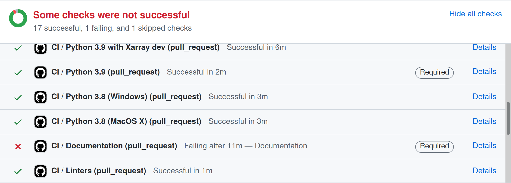

.. _testing guide:

*************
Testing Guide
*************

.. contents:: Table of Contents
   :depth: 2
   :local:
   :backlinks: none

Summary
=======

* New functionality added to PlasmaPy must also have tests.

* Tests are located in files that begin with :file:`test_` which are
  inside subdirectories named :file:`tests/`.

* Tests are either functions beginning with ``test_`` or classes
  beginning with ``Test``.

* Here is an example of a minimal ``pytest`` test that uses an
  :py:`assert` statement:

  .. code-block:: python

      def test_multiplication():
          assert 2 * 3 == 6

* To install the packages needed to run the tests:

  - Open a terminal.

  - Navigate to the top-level directory (probably named
    :file:`PlasmaPy/`) in your local clone of PlasmaPy's repository.

  - If you are on macOS or Linux, run:

    .. code-block:: console

       python -m pip install -e ".[tests]"

    If you are on Windows, run:

    .. code-block:: console

       py -m pip install -e .[tests]

    These commands will perform an |editable installation| of your
    local clone of PlasmaPy.

* Run ``pytest`` in the command line in order to run tests in that
  directory and its subdirectories.

Introduction
============

Software testing is vital for software reliability and maintainability.
Software tests help us to:

* Find and fix bugs.
* Prevent old bugs from getting re-introduced.
* Provide confidence that our code is behaving correctly.
* Define what "correct behavior" actually is.
* Speed up code development and refactoring.
* Show future contributors examples of how code was intended to be used.
* Confirm that our code works on different operating systems and
  with different versions of software dependencies.
* Enable us to change code with confidence that we are not unknowingly
  introducing bugs elsewhere in our program.

.. tip::

   Writing tests takes time, but debugging takes more time.

Every code contribution to PlasmaPy with new functionality must also
have corresponding tests. Creating or updating a pull request will
activate PlasmaPy's test suite to be run via |GitHub Actions|, along
with some additional checks. The results of the test suite are shown at
the bottom of each pull request. Click on *Details* next to each test
run to find the reason for any test failures.

A |unit test| verifies a single unit of behavior, does it quickly, and
does it in isolation from other tests :cite:p:`khorikov:2020`. A typical
|unit test| is broken up into three parts: *arrange*, *act*, and
*assert* :cite:p:`osherove:2013`. An |integration test| verifies that
multiple software components work together as intended.

PlasmaPy's tests are set up using the `pytest` framework. The tests for a
subpackage are located in its :file:`tests/` subdirectory in files with
names of the form :file:`test_*.py`. For example, tests for
`plasmapy.formulary.speeds` are located at
:file:`plasmapy/formulary/tests/test_speeds.py` relative to the top
of the package. Example code contained within docstrings is tested to
make sure that the actual printed output matches what is in the
docstring.

.. _writing-tests:

Writing Tests
=============

Every code contribution that adds new functionality requires both tests
and documentation in order to be merged. Here we describe the process of
write a test.

Locating tests
--------------

The tests for each subpackage are contained in its :file:`tests/`
subdirectory. For example, the tests for `plasmapy.particles` are
located in :file:`plasmapy/particles/tests/`. Test files begin with
:file:`test_` and generally contain either the name of the module or a
description of the behavior that is being tested. For example, tests for
|Particle| are located at
:file:`plasmapy/particles/tests/test_particle_class.py`.

The functions that are to be tested in each test file are prepended with
``test_`` and end with a description of the behavior that is being
tested. For example, a test that checks that a |Particle| can be turned
into an antiparticle could be named ``test_particle_inversion``.

Strongly related tests may also be `grouped into classes`_. The name of
such a class begins with ``Test`` and the methods to be tested begin
with ``test_``. For example, :file:`test_particle_class.py` could define
the ``TestParticle`` class containing the method ``test_charge_number``.

More information on test organization, naming, and collection is
provided in pytest_'s documentation on `test discovery conventions`_.

Assertions
----------

A software test runs a section of code and checks that a particular
condition is met. If the condition is not met, then the test fails. Here
is a minimal software test:

.. code-block:: python

   def test_addition():
       assert 2 + 2 == 4

The most common way to check that a condition is met is through an
``assert`` statement, as in this example. If the expression that follows
``assert`` evaluates to `False`, then this statement will raise an
`AssertionError` so that the test will fail.  If the expression that
follows ``assert`` evaluates to `True`, then this statement will do
nothing and the test will pass.

When ``assert`` statements raise an `AssertionError`, `pytest` will
display the values of the expressions evaluated in the ``assert``
statement. The automatic output from `pytest` is sufficient for simple
tests like above. For more complex tests, we can add a descriptive error
message to help us find the cause of a particular test failure.

.. code-block:: python

   def test_addition():
       actual = 2 + 2
       expected = 4
       assert actual == expected, f"2 + 2 returns {actual} instead of {expected}."

.. tip::

   Use `f-strings`_ to improve error message readability.

Type hint annotations
---------------------

PlasmaPy has begun using |mypy| to perform |static type checking| on
|type hint annotations|. Adding a :py:`-> None` return annotation lets
|mypy| verify that tests do not have :py:`return` statements.

.. code-block:: python

   def test_addition() -> None:
       assert 2 * 2 == 4

Floating point comparisons
--------------------------

.. caution::

   Using ``==`` to compare floating point numbers can lead to brittle
   tests because of slight differences due to limited precision,
   rounding errors, and revisions to fundamental constants.

In order to avoid these difficulties, use
`numpy.testing.assert_allclose` when comparing floating point numbers
and arrays, and ``astropy.tests.helper.assert_quantity_allclose`` when
comparing |Quantity| instances. The ``rtol`` keyword for each of these
functions sets the acceptable relative tolerance. The value of ``rtol``
should be set ∼1–2 orders of magnitude greater than the expected
relative uncertainty. For mathematical functions, a value of
``rtol=1e-14`` is often appropriate. For quantities that depend on
physical constants, a value between ``rtol=1e-8`` and ``rtol=1e-5`` may
be required, depending on how much the accepted values for fundamental
constants are likely to change.

Testing warnings and exceptions
-------------------------------

Robust testing frameworks should test that functions and methods return
the expected results, issue the expected warnings, and raise the
expected exceptions. `pytest` contains functionality to `test warnings`_
and `test exceptions`_.

To test that a function issues an appropriate warning, use
`pytest.warns`.

.. code-block:: python

   import warnings

   import pytest

   def issue_warning() -> None:
       warnings.warn("warning message", UserWarning)

   def test_that_a_warning_is_issued() -> None:
       with pytest.warns(UserWarning):
           issue_warning()

To test that a function raises an appropriate exception, use
`pytest.raises`.

.. code-block:: python

   import pytest

   def raise_exception() -> None:
       raise Exception

   def test_that_an_exception_is_raised() -> None:
       with pytest.raises(Exception):
           raise_exception()

Test independence and parametrization
-------------------------------------

In this section, we'll discuss the issue of parametrization based on an
example of a :wikipedia:`proof <Riemann_hypothesis#Excluded_middle>` of
Gauss's class number conjecture.

The proof goes along these lines:

* If the generalized Riemann hypothesis is true, the conjecture is true.

* If the generalized Riemann hypothesis is false, the conjecture is also
  true.

* Therefore, the conjecture is true.

One way to use pytest would be to write sequential test in a single
function.

.. code-block:: python

   def test_proof_by_riemann_hypothesis() -> None:
       assert proof_by_riemann(False)
       assert proof_by_riemann(True)  # will only be run if the previous test passes

If the first test were to fail, then the second test would never be run.
We would therefore not know the potentially useful results of the second
test. This drawback can be avoided by making independent tests so that
both will be run.

.. code-block:: python

   def test_proof_if_riemann_false() -> None:
       assert proof_by_riemann(False)

   def test_proof_if_riemann_true() -> None:
       assert proof_by_riemann(True)

However, this approach can lead to cumbersome, repeated code if you are
calling the same function over and over. If you wish to run multiple
tests for the same function, the preferred method is to decorate it with
:py:`@pytest.mark.parametrize`.

.. code-block:: python

   @pytest.mark.parametrize("truth_value", [True, False])
   def test_proof_if_riemann(truth_value: bool) -> None:
       assert proof_by_riemann(truth_value)

This code snippet will run :py:`proof_by_riemann(truth_value)` for each
``truth_value`` in :py:`[True, False]`. Both of the above tests will be
run regardless of failures. This approach is much cleaner for long lists
of arguments, and has the advantage that you would only need to change
the function call in one place if the function changes.

With qualitatively different tests you would use either separate
functions or pass in tuples containing inputs and expected values.

.. code-block:: python

   @pytest.mark.parametrize("truth_value, expected", [(True, True), (False, True)])
   def test_proof_if_riemann(truth_value: bool, expected: bool) -> None:
       assert proof_by_riemann(truth_value) == expected

Test parametrization with argument unpacking
~~~~~~~~~~~~~~~~~~~~~~~~~~~~~~~~~~~~~~~~~~~~

When the number of arguments passed to a function varies, we can use
argument unpacking_ in conjunction with test parametrization.

Suppose we want to test a function called ``add`` that accepts two
positional arguments (``a`` and ``b``) and one optional keyword argument
(``reverse_order``).

.. code-block:: python

   def add(a: float | str, b: float | str, reverse_order: bool = False) -> float | str:
       if reverse_order:
           return b + a
       return a + b

.. hint::

   This function uses |type hint annotations| to indicate that ``a`` and
   ``b`` can be either a :py:`float` or :py:`str`, :py:`reverse_order`
   should be a :py:`bool`, and :py:`add` should return a :py:`float` or
   :py:`str`.

Argument unpacking_ lets us provide positional arguments in a `tuple` or
`list` (commonly referred to as :term:`args`) and keyword arguments in a
`dict` (commonly referred to as :term:`kwargs`). Unpacking_ occurs when
``args`` is preceded by ``*`` and ``kwargs`` is preceded by ``**``.

.. code-block:: pycon

   >>> args = ("1", "2")
   >>> kwargs = {"reverse_order": True}
   >>> add(*args, **kwargs)  # equivalent to add("1", "2", reverse_order=True)
   '21'

We want to test ``add`` for three cases:

* ``reverse_order`` is `True`,
* ``reverse_order`` is `False`, and
* ``reverse_order`` is *not specified*.

We can do this by parametrizing the test over ``args`` and ``kwargs``,
and unpacking_ them inside of the test function.

.. code-block:: python

   @pytest.mark.parametrize(
       "args, kwargs, expected",
       [
           # test that add("1", "2", reverse_order=False) == "12"
           (["1", "2"], {"reverse_order": False}, "12"),
           # test that add("1", "2", reverse_order=True) == "21"
           (["1", "2"], {"reverse_order": True}, "21"),
           # test that add("1", "2") == "12"
           (["1", "2"], {}, "12"),  # if no keyword arguments, use an empty dict
       ],
   )
   def test_add(args: list[str], kwargs: dict[str, bool], expected: str) -> None:
       assert add(*args, **kwargs) == expected

.. hint::

   This function uses |type hint annotations| to indicate that ``args``
   should be a `list` containing `str` objects, ``kwargs`` should be a
   `dict` containing `str` objects that map to `bool` objects,
   ``expected`` should be a `str`, and that there should be no
   :py:`return` statement.

Fixtures
--------

Fixtures_ provide a way to set up well-defined states in order to have
consistent tests. We recommend using fixtures whenever you need to test
multiple properties (thus, using multiple test functions) for a series
of related objects.

Property-based testing
----------------------

Suppose a function :math:`f(x)` has a property that :math:`f(x) > 0` for
all :math:`x`. A property-based test would verify that :py:`f(x)` — the
code implementation of :math:`f(x)` — returns positive output for
multiple values of :math:`x`. The hypothesis_ package simplifies
`property-based testing`_ for Python.

.. _testing-best-practices:

Best practices
==============

The following list contains suggested practices for testing scientific
software and making tests easier to run and maintain. These guidelines
are not rigid, and should be treated as general principles should be
balanced with each other rather than absolute principles.

* **Run tests frequently for continual feedback.** If we edit a single
  section of code and discover a new test failure, then we know that the
  problem is related to that section of code. If we edit numerous
  sections of code before running tests, then we will have a much
  harder time isolating the section of code causing problems.

* **Turn bugs into test cases** :cite:p:`wilson:2014`. It is said that
  "every every bug exists because of a missing test"
  :cite:p:`bernstein:2015`. After finding a bug, write a minimal failing
  test that reproduces that bug. Then fix the bug to get the test to
  pass. Keeping the new test in the test suite will prevent the same bug
  from being introduced again. Because bugs tend to be clustered around
  each other, consider adding tests related to the functionality
  affected by the bug.

* **Make tests fast.** Tests are most valuable when they provide
  immediate feedback. A test suite that takes a long time to run
  increases the probability that we will lose track of what we are
  doing and slows down progress.

  Decorate unavoidably slow tests with :py:`@pytest.mark.slow`:

  .. code-block:: python

     @pytest.mark.slow
     def test_calculating_primes() -> None:
         calculate_all_primes()

* **Write tests that are easy to understand and change.** To fully
  understand a test failure or modify existing functionality, a
  contributor will need to understand both the code being tested and the
  code that is doing the testing. Test code that is difficult to
  understand makes it harder to fix bugs, especially if the error
  message is missing or hard to understand, or if the bug is in the test
  itself. When test code is difficult to change, it is harder to change
  the corresponding production code. Test code should therefore be kept
  as high quality as production code.

* **Write code that is easy to test.** Write short functions that do
  exactly one thing with no side effects. Break up long functions into
  multiple functions that are smaller and more focused. Use
  :wikipedia:`pure functions <pure_function>` rather than functions that
  change the underlying state of the system or depend on non-local
  variables. Use :wikipedia:`test-driven development
  <Test-driven_development>` and write tests before writing the code to
  be tested. When a section of code is difficult to test, consider
  refactoring_ it to make it easier to test.

* **Separate easy-to-test code from hard-to-test code.** Some
  functionality is inherently hard to test, such as graphical user
  interfaces. Often the hard-to-test behavior depends on particular
  functionality that is easy to test, such as function calls that return
  a well-determined value. Separating the hard-to-test code from the
  easy-to-test code maximizes the amount of code that can be tested
  thoroughly and isolates the code that must be tested manually. This
  strategy is known as the *Humble Object pattern*.

* **Make tests independent of each other.** Tests that are coupled with
  each other lead to several potential problems. Side effects from one
  test could prevent another test from failing, and tests lose their
  ability to run in parallel. Tests can become coupled when the same
  mutable `object` is used in multiple tests. Keeping tests independent
  allows us to avoid these problems.

* **Make tests deterministic.** When a test fails intermittently, it is
  hard to tell when it has actually been fixed. When a test is
  deterministic, we will always be able to tell if it is passing or
  failing. If a test depends on random numbers, use the same random
  seed for each automated test run.

* **Avoid testing implementation details.** Fine-grained tests help us
  find and fix bugs. However, tests that are too fine-grained become
  brittle and lose resistance to refactoring. Avoid testing
  implementation details that are likely to be changed in future
  refactorings.

* **Avoid complex logic in tests.** When the *arrange* or *act* sections
  of a test include conditional blocks, most likely the test is
  verifying more than one unit of behavior and should be split into
  multiple smaller tests.

* **Test a single unit of behavior in each unit test.** This suggestion
  often implies that there should be a single assertion per |unit test|.
  However, multiple related assertions are appropriate when needed to
  verify a particular unit of behavior. However, having multiple
  assertions in a test often indicates that the test should be split up
  into multiple smaller and more focused tests.

* If the *act* phase of a |unit test| is more than a single line of
  code, consider revising the functionality being tested so that it can
  be called in a single line of code :cite:p:`khorikov:2020`.

Running tests
=============

PlasmaPy's tests can be run in the following ways:

1. Creating and updating a pull request on |GitHub|.
2. Running `pytest` from the command line.
3. Running |tox| from the command line.
4. Running tests from an :wikipedia:`integrated development environment
   <integrated_development_environment>` (IDE).

We recommend that new contributors perform the tests via a pull request
on |GitHub|. Creating a draft pull request and keeping it updated will
ensure that the necessary checks are run frequently. This approach is
also appropriate for pull requests with a limited scope. This advantage
of this approach is that the tests are run automatically and do not
require any extra work. The disadvantages are that running the tests on
|GitHub| is often slow and that navigating the test results is sometimes
difficult.

We recommend that experienced contributors run tests either by using
`pytest` from the command line or by using your preferred IDE. Using |tox|
is an alternative to `pytest`, but running tests with |tox| adds the
overhead of creating an isolated environment for your test and can thus
be slower.

Using GitHub
------------

The recommended way for new contributors to run PlasmaPy's full test
suite is to `create a pull request`_ from your development branch to
|PlasmaPy's GitHub repository|. The test suite will be run
automatically when the pull request is created and every time changes
are pushed to the development branch on |GitHub|. Most of these checks
have been automated using |GitHub Actions|.

The following image shows how the results of the checks will appear in
each pull request near the end of the *Conversation* tab. Checks that
pass are marked with ✔️, while tests that fail are marked with ❌. Click
on *Details* for information about why a particular check failed.

The following checks are performed with each pull request.

* Checks with labels like **CI / Python 3.x (pull request)** verify that
  PlasmaPy works with different versions of Python and other
  dependencies, and on different operating systems. These tests are set
  up using |tox| and run with `pytest` via |GitHub Actions|. When
  multiple tests fail, investigate these tests first.

  .. tip::

     `Python 3.10 <https://docs.python.org/3.10/whatsnew/3.10.html>`__,
     `Python 3.11 <https://docs.python.org/3.11/whatsnew/3.11.html>`__,
     and
     `Python 3.12 <https://docs.python.org/3.12/whatsnew/3.12.html>`__
     include (or will include) significant improvements to common error
     messages.

* The **CI / Documentation (pull_request)** check verifies that
  |PlasmaPy's documentation| is able to build correctly from the pull
  request. Warnings are treated as errors.

* The **docs/readthedocs.org:plasmapy** check allows us to preview
  how the documentation will appear if the pull request is merged.
  Click on *Details* to access this preview.

* The check labeled **changelog: found** or **changelog: absent**
  indicates whether or not a changelog entry with the correct number
  is present, unless the pull request has been labeled with "No
  changelog entry needed".

  * The :file:`changelog/README.rst` file describes the process for
    adding a changelog entry to a pull request.

* The **codecov/patch** and **codecov/project** checks generate test
  coverage reports that show which lines of code are run by the test
  suite and which are not. Codecov_ will automatically post its report
  as a comment to the pull request. The Codecov_ checks will be marked
  as passing when the test coverage is satisfactorily high. For more
  information, see the section on :ref:`code-coverage`.

* The **CI / Importing PlasmaPy (pull_request)** checks that it is
  possible to run :py:`import plasmapy`.

* PlasmaPy uses |black| to format code and |isort| to sort ``import``
  statements. The **CI / Linters (pull_request)** and
  **pre-commit.ci - pr** checks verify that the pull request meets these
  style requirements. These checks will fail when inconsistencies with
  the output from |black| or |isort| are found or when there are syntax
  errors. These checks can usually be ignored until the pull request is
  nearing completion.

  .. tip::

     The required formatting fixes can be applied automatically by
     writing a comment with the message ``pre-commit.ci autofix`` to the
     *Conversation* tab on a pull request, as long as there are no
     syntax errors. This approach is much more efficient than making the
     style fixes manually. Remember to ``git pull`` afterwards!

  .. note::

     When using pre-commit, a hook for codespell_ will check for and fix
     common misspellings. If you encounter any words caught by
     codespell_ that should *not* be fixed, please add these false
     positives to ``ignore-words-list`` under ``codespell`` in
     :file:`pyproject.toml`.

* The **CI / Packaging (pull request)** check verifies that no errors
  arise that would prevent an official release of PlasmaPy from being
  made.

* The **Pull Request Labeler / triage (pull_request_target)** check
  applies appropriate |GitHub| labels to pull requests.

.. note::

   For first-time contributors, existing maintainers `may need to
   manually enable your `GitHub Action test runs
   <https://docs.github.com/en/actions/managing-workflow-runs/approving-workflow-runs-from-public-forks>`__.
   This is, believe it or not, indirectly caused by the invention of
   cryptocurrencies.

.. note::

   The continuous integration checks performed for pull requests change
   frequently. If you notice that the above list has become out-of-date,
   please `submit an issue that this section needs updating
   <https://github.com/PlasmaPy/PlasmaPy/issues/new?title=Update%20information%20on%20GitHub%20checks%20in%20testing%20guide&labels=Documentation>`__.

Using pytest
------------

To install the packages necessary to run tests on your local computer
(including |tox| and pytest_), run:

.. code-block:: shell

   pip install -e .[tests]

To run PlasmaPy's tests from the command line, go to a directory within
PlasmaPy's repository and run:

.. code-block:: shell

   pytest

This command will run all of the tests found within your current
directory and all of its subdirectories. Because it takes time to run
PlasmaPy's tests, it is usually most convenient to specify that only a
subset of the tests be run. To run the tests contained within a
particular file or directory, include its name after ``pytest``. If you
are in the directory :file:`plasmapy/particles/tests/`, then the tests
in in :file:`test_atomic.py` can be run with:

.. code-block:: shell

   pytest test_atomic.py

The documentation for `pytest` describes `how to invoke pytest`_ and
specify which tests will or will not be run. A few useful examples of
flags you can use with it:

* Use the ``--tb=short`` to shorten traceback reports, which is useful
  when there are multiple related errors. Use ``--tb=long`` for
  traceback reports with extra detail.

* Use the ``-x`` flag to stop the tests after the first failure. To stop
  after :math:`n` failures, use ``--maxfail=n`` where ``n`` is replaced
  with a positive integer.

* Use the ``-m 'not slow'`` flag to skip running slow (defined by the
  ``@pytest.mark.slow`` marker) tests, which is
  useful when the slow tests are unrelated to your changes. To exclusively
  run slow tests, use ``-m slow``.

* Use the ``--pdb`` flag to enter the `Python debugger`_ upon test
  failures.

Using tox
---------

PlasmaPy's continuous integration tests on |GitHub| are typically run
using |tox|, a tool for automating Python testing. Using |tox| simplifies
testing PlasmaPy with different releases of Python, with different
versions of PlasmaPy's dependencies, and on different operating systems.
While testing with |tox| is more robust than testing with `pytest`, using
|tox| to run tests is typically slower because |tox| creates its own
virtual environments.

To run PlasmaPy's tests for a particular environment, run:

.. code-block:: shell

   tox -e ⟨envname⟩

where ``⟨envname⟩`` is replaced with the name of the |tox| environment,
as described below.

Some testing environments for |tox| are pre-defined. For example, you
can replace ``⟨envname⟩`` with ``py39`` if you are running Python
``3.9.x``, ``py310`` if you are running Python ``3.10.x``, or ``py311``
if you are running Python ``3.11.x``. Running |tox| with any of these
environments requires that the appropriate version of Python has been
installed and can be found by |tox|. To find the version of Python that
you are using, go to the command line and run ``python
--version``.

Additional `tox environments`_ are defined in :file:`tox.ini` in the
top-level directory of PlasmaPy's repository. To find which testing
environments are available, run:

.. code-block:: shell

   tox -a

For example, static type checking with |mypy| can be run locally with

.. code-block:: shell

   tox -e mypy

Commands using |tox| can be run in any directory within PlasmaPy's
repository with the same effect.

.. _code-coverage:

Code coverage
-------------

:wikipedia:`Code coverage <Code_coverage>` refers to a metric "used to
describe the degree to which the source code of a program is executed
when a particular test suite runs." The most common code coverage metric
is line coverage:

.. math::

   \mbox{line coverage} ≡
   \frac{
      \mbox{number of lines accessed by tests}
   }{
      \mbox{total number of lines}
   }

Line coverage reports show which lines of code have been used in a test
and which have not. These reports show which lines of code remain to be
tested, and sometimes indicate sections of code that are unreachable.

.. tip::

   Use test coverage reports to write tests that target untested
   sections of code and to find unreachable sections of code.

.. caution::

   While a low value of line coverage indicates that the code is not
   adequately tested, a high value does not necessarily indicate that
   the testing is sufficient. A test that makes no assertions has little
   value, but could still have high test coverage.

PlasmaPy uses `coverage.py`_ and the `pytest-cov`_ plugin for `pytest` to
measure code coverage and Codecov_ to provide reports on GitHub.

Generating coverage reports with pytest
---------------------------------------

Code coverage reports may be generated on your local computer to show
which lines of code are covered by tests and which are not. To generate
an HTML report, use the ``--cov`` flag for ``pytest``:

.. code-block:: shell

   pytest --cov
   coverage html

Open :file:`htmlcov/index.html` in your web browser to view the coverage
reports.

Excluding lines in coverage reports
-----------------------------------

Occasionally there will be certain lines that should not be tested. For
example, it would be impractical to create a new testing environment to
check that an `ImportError` is raised when attempting to import a
missing package. There are also situations that coverage tools are not
yet able to handle correctly.

To exclude a line from a coverage report, end it with
``# coverage: ignore``. Alternatively, we may add a line to
``exclude_lines`` in the ``[coverage:report]`` section of
:file:`setup.cfg` that consists of a
a pattern that indicates that a line be excluded from coverage reports.
In general, untested lines of code should remain marked as untested to
give future developers a better idea of where tests should be added in
the future and where potential bugs may exist.

Coverage configurations
-----------------------

Configurations for coverage tests are given in the ``[coverage:run]``
and ``[coverage:report]`` sections of :file:`setup.cfg`. Codecov_
configurations are given in :file:`.codecov.yaml`.

Using an integrated development environment
-------------------------------------------

Most IDEs have built-in tools that simplify software testing. IDEs like
PyCharm_ and `Visual Studio`_ allow test configurations to be run with a
click of the mouse or a few keystrokes. While IDEs require time to
learn, they are among the most efficient methods to interactively
perform tests. Here are instructions for running tests in several
popular IDEs:

* `Python testing in PyCharm
  <https://www.jetbrains.com/help/pycharm/testing-your-first-python-application.html>`__
* `Python testing in Visual Studio Code
  <https://code.visualstudio.com/docs/python/testing>`__

.. |integration test| replace:: :term:`integration test`
.. |unit test| replace:: :term:`unit test`

.. _Atom: https://atom.io
.. _Codecov: https://about.codecov.io
.. _codespell: https://github.com/codespell-project/codespell
.. _`coverage.py`: https://coverage.readthedocs.io
.. _`create a pull request`: https://docs.github.com/en/pull-requests/collaborating-with-pull-requests/proposing-changes-to-your-work-with-pull-requests
.. _fixtures: https://docs.pytest.org/en/latest/explanation/fixtures.html
.. _`f-strings`: https://docs.python.org/3/tutorial/inputoutput.html#tut-f-strings
.. _`grouped into classes`: https://docs.pytest.org/en/latest/getting-started.html#group-multiple-tests-in-a-class
.. _`how to invoke pytest`: https://docs.pytest.org/en/latest/how-to/usage.html
.. _hypothesis: https://hypothesis.readthedocs.io
.. _`property-based testing`: https://hypothesis.works/articles/what-is-hypothesis
.. _PyCharm: https://www.jetbrains.com/pycharm
.. _pytest: https://docs.pytest.org
.. _`pytest-cov`: https://pytest-cov.readthedocs.io
.. _`Python debugger`: https://docs.python.org/3/library/pdb.html
.. _refactoring: https://refactoring.guru/refactoring/techniques
.. _`test discovery conventions`: https://docs.pytest.org/en/latest/goodpractices.html#conventions-for-python-test-discovery
.. _`test warnings`: https://docs.pytest.org/en/latest/warnings.html#warns
.. _`test exceptions`: https://docs.pytest.org/en/latest/assert.html#assertions-about-expected-exceptions
.. _`tox environments`: https://tox.wiki/en/stable/config.html#tox-environment
.. _unpacking: https://docs.python.org/3/tutorial/controlflow.html#unpacking-argument-lists
.. _`Visual Studio`: https://visualstudio.microsoft.com
